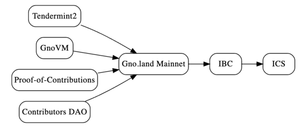
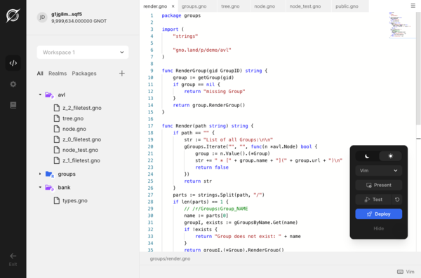

# GnoLand开发进度月度更新2023年4月

上个月我们在各方面都有不错的进展，吸纳了更多开发者并收到大量的Game of Realms比赛贡献。为了鼓励交流和开发，公司设置了每两周一次的公开开发者会议和“Office Hours”会话。。在上个月的会议上，参与者就讨论了Gno IDE、Gno.land网站语言以及GnoVM、IBC和ICS等话题。同时，公司创始人Jae Kwon还于3月份在EthDenver和San Francisco的游戏开发者大会（GDC）上举办了两个实体活动，为开发者们提供了更多学习机会。

## 开发人员更新

这个月的主要话题是Gno IDE, Gno.land网站语言和UX，垃圾收集，错误修复，以及如何将IBC和ICS引入平台。我们正在同时处理所有这些问题，但发布的顺序将是Gno.land主网，IBC，然后ICS。

## Gno网站语言

我们希望为开发者增加更多功能，例如提供库文件以使接口编写更为完善和一致。我们现在有一个公开话题，邀请具备排版技能和库开发经验的前端开发人员共同创建一个用于markdown或自定义渲染系统的UI框架。

在内部，我们的核心团队正在改进Gno.land网站，使它更易于导航，并确保文本是以markdown为中心的，并且在纯文本和GitHub渲染机器中可读性良好。我们希望使用CSS，而无需对markdown解析器进行扩展。

## Gno IDE

Gno.land开发者体验团队正在开发一个基于web的Gno IDE，通过访问web应用程序就可以在浏览器上快速构建Gno合约和包。Gno IDE将为构建合约的一切提供改进的UX(包括使测试更容易)，以及在编辑器中的代码自动补全等附加功能。Gno IDE将包含您期望从IDE中获得的所有功能，以及为围绕Gno构建工具的开发人员提供的有价值的api。

## IBC和ICS 

如上所述，Gno.land主网将首先启动，然后是IBC，然后是ICS。我们将专注于实现IBC1，因为我们坚信ICS模型，并希望成为现有Cosmos链的消费者。我们想要一个通用的ICS实现，它可以跨多个中心工作，因为Gno.land是一种类型的中心，它需要自己的ICS来扩展，同时在Cosmos hub的消费者链上提供GnoVM。我们的下一步是找到为Gno配置ICS的最佳方法。登陆并使GnoVM在Cosmos Hub系统中作为消费链。 

关于IBC，我们将使用当前为Cosmos SDK编写的实现，并将其移植到Tendermint2中。我们预计在这个过程中会遇到一些问题，包括需要应用于我们代码库的安全补丁。目前有多个方向和讨论正在进行，以探索如何桥接Gno.land的智能合约与IBC，从而实现Interchain智能合约交互。

一种可能性是使用一个API向传出事件队列提交事件，并使用另一个队列异步接收和使用事件。这种机制可以使IBC2具有丰富的链间合约特性，同样的API也可以用于需要高级选项的链间加智能合约交互。我们讨论了为链间合约创建标准的建议，这样IBC2最终可以通过与EVM、其他语言和CosmWasm一起应用来实现标准化，从而消除限制。 

这个协议可以基于Protobuf或类似的众所周知的语法定义协议，以便我们将Interchain推向更高一个层次。IBC2将是安全和快速的，并取代多种技术之间脆弱的跨链桥。这是我们致力于开发的一项重大更新，我们需要帮助识别涉及到的所有挑战。在IBC集成方面的工作，与Gno.land主网的启动分开进行，需要花费相当长的时间来了解轻客户端系统的工作原理。如果您有兴趣承担这个任务，请告诉我们，我们将组建一个团队。IBC可能是Game of Realms第二阶段中最重要的挑战。

## 垃圾回收
目前，我们在垃圾回收方面的工作并没有像传统的Golang那样解决内存效率问题。相反，我们正在逐步优化和改进主状态树，通过自动清理孤立节点来实现。下一阶段将针对官方垃圾收集器组件进行定向优化，开始处理内存管理，因为我们遇到了一些常见的Golang垃圾收集挑战，但同时也发现一些不常见的问题。

我们需要考虑元素的存放位置，因为这与以无锁并发方式释放它们有关。我们还需要一个好的数据结构。目前，我们正在进行研究，以实现一种专门的例程，以非阻塞方式同步地清理东西。

## Game of Realms

这个月，我们看到了对Game of Realms第一阶段贡献量的巨大增长，涌现出大量的问题、讨论和PR。我们所做的最重要的事情之一是添加对MOD的支持，它是一个带有更易于管理依赖关系和版本控制系统接口的Go mod版本。您可以在GitHub上跟踪正在进行的问题。

对于评估DAO和治理模块，以及代码库中的大型CLI重构，也有一些非常强大的贡献。我们还看到人们编写了诸如GRC 1155之类的合约，或对现有Realms进行了普遍改进，并提出了许多修复漏洞的建议。发现漏洞并报告用户需求是Gno.land平台得到采用和受欢迎的良好迹象。

## 开发人员的美国线下活动
上个月，Gno.land在EthDenver期间举办了一次生动的聚会，Gno.land创始人和核心开发者Jae Kwon为Solidity开发者发表了题为“Gno.land，即将到来的下一代智能合约平台”的演讲。他将Gno.land和Gnolang与Solidity进行了比较，并展示了GnoVM如何改变智能合约的范式。您可以在这里观看录像。

同样是在三月份，Jae在旧金山的著名游戏开发者大会（GDC）的一个副活动上主持了一场游戏研讨会。“Gno.land面向游戏开发者，使用Web3构建您的应用程序”，向参与者展示了一个在Gno.land平台上构建的样例游戏应用程序，并提供了写入应用程序智能合约的机会。

## 线上活动-如何构建论坛
Gno.land的核心技术负责人Miloš Živković为Go开发者举办了一次名为“如何构建论坛”的虚拟研讨会。他展示了Gnolang是一种快速、简单的构建和发布智能合约的方式，使用Gnolang解释器虚拟机对Gno进行解释，消除了任何服务器或ORN的需求。

虚拟机允许您的Gno.land应用程序的内存状态在每个事务函数调用后自动保留，这是一种处理交易量和内存回收的全新方式。您可以在这里观看完整的教程。

我们希望社区参与Gno.land的每月更新，因此如果您正在Gno.land上开发，并想要突出您的开发、项目、事件或想法，请告诉我们，我们将包含您的贡献。

::: tip 
本篇文章翻译自以下链接，部分表述可能会存在不恰当，更准确的信息可以点击链接查看
- [The More You Gno: Gno.land Monthly Updates](https://test3.gno.land/r/gnoland/blog:p/monthly-dev-1)
:::